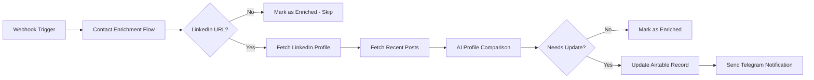
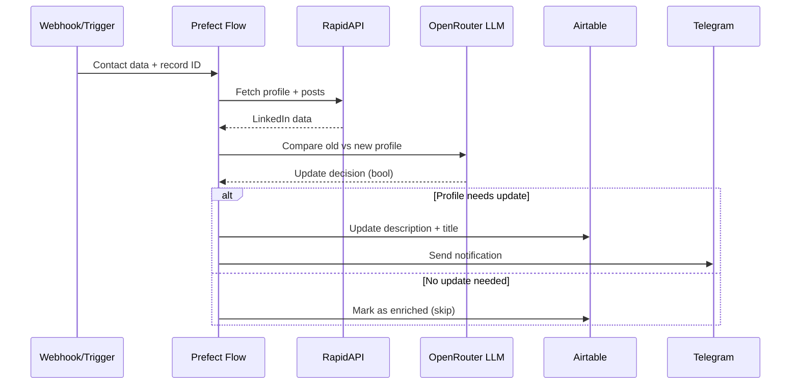

# Contact Enrichment Flow

## Abstract

Contact Enrichment Flow is an automated workflow that enriches contact records in Airtable with fresh LinkedIn profile data. The system monitors contact records, fetches current LinkedIn information, compares it against existing data using AI-powered analysis, and updates records when meaningful changes are detected (new position, company change). Built on Prefect for orchestration and deployed on Google Cloud Platform, it integrates OpenRouter's LLM API for intelligent profile comparison, RapidAPI for LinkedIn data retrieval, and includes Telegram notifications for enrichment events.

**Key Technologies:** Python, Prefect 3.x, OpenAI/OpenRouter API, Airtable API, RapidAPI (LinkedIn data), Docker, PostgreSQL, Redis

**Target Audience:** VC firms, sales teams, or organizations maintaining contact databases who need automated contact intelligence updates without manual monitoring.

## Project Overview

### The Problem
Contact databases quickly become stale. LinkedIn profiles change frequently with new positions, companies, and professional updates. Manually checking and updating contact records is time-consuming and scales poorly. Organizations miss critical relationship intelligence—knowing when a contact switches companies or gets promoted—which impacts outreach timing and relevance.

### Key Features
- **Automated LinkedIn profile retrieval** via RapidAPI integration with retry logic
- **AI-powered profile comparison** using GPT-4o to detect meaningful changes (new roles, companies)
- **Selective updates** that ignore minor differences and focus on key career changes
- **Airtable integration** for seamless record management with automatic enrichment flags
- **Error handling and retries** built into each task for reliability
- **Telegram notifications** when profiles are successfully enriched
- **Webhook-triggered execution** for event-driven enrichment

### Technical Architecture
The system operates as a Prefect flow with discrete tasks for data retrieval, AI analysis, and database updates. Each task includes retry policies (2 retries with 30-300 second delays). The flow receives Airtable record data via webhook, validates LinkedIn URLs, fetches profile data and recent posts, constructs comparison prompts, uses LLMs to determine if updates are needed, then updates records or marks them as enriched. Prefect handles orchestration, scheduling, and observability. The deployment runs on Google Cloud Platform using a Prefect work pool, with environment variables for API credentials injected at deployment time.



**Data Flow**


## Getting Started

### Prerequisites
- Python 3.9+ installed locally
- Prefect Cloud account or self-hosted Prefect instance
- Google Cloud Platform account with Compute Engine access
- API keys: OpenRouter, RapidAPI (Fresh LinkedIn Profile Data), Airtable

### Installation

1. Clone the repository
```bash
git clone https://github.com/s16vc/contact_enrichment.git
cd contact_enrichment
```

2. Create virtual environment and install dependencies
```bash
python -m venv .venv
source .venv/bin/activate  # On Windows: .venv\Scripts\activate
pip install -r requirements.txt
```

3. Configure environment variables (create `.env` file)
```bash
OPENROUTER_API_KEY=your_openrouter_key
RAPID_API_KEY=your_rapidapi_key
AIRTABLE_API_KEY=your_airtable_key
PREFECT_API_URL=http://34.163.142.11:4200/api
```

4. Deploy the flow to Prefect
```bash
python deploy.py
```

### Basic Usage

Trigger the flow manually with test data:
```python
from hello import contact_enrichment

data = {
    "id": "recXXXXXXXXXX",
    "fields": {
        "Name": "John Doe",
        "LinkedIn": "https://www.linkedin.com/in/johndoe/",
        "Description": "Current role description",
        "Title": "VP of Engineering"
    }
}

contact_enrichment(data)
```

Or via webhook/API (replace `{deployment-id}` with your actual deployment ID):
```bash
curl -X POST "http://34.163.142.11:4200/api/deployments/{deployment-id}/create_flow_run" \
  -H "Content-Type: application/json" \
  -d '{
    "parameters": {
      "data": {
        "id": "recXXXXXXXXXX",
        "fields": {
          "Name": "John Doe",
          "LinkedIn": "https://www.linkedin.com/in/johndoe/",
          "Description": "Current role description",
          "Title": "VP of Engineering"
        }
      }
    }
  }'
```

Example with actual deployment ID:
```bash
curl -X POST "http://34.163.142.11:4200/api/deployments/2baf1751-8f97-4afc-b76e-6b3c43f5c9fb/create_flow_run" \
  -H "Content-Type: application/json" \
  -d '{
    "parameters": {
      "data": {
        "id": "recJl2u923ejqLY5f",
        "fields": {
          "Name": "Camille Ricketts",
          "LinkedIn": "https://www.linkedin.com/in/camillericketts/",
          "Description": "Mixing Board Member",
          "Title": "Mixing Board Member"
        }
      }
    }
  }'
```

### Troubleshooting

**Issue:** LinkedIn profile returns 404 or no data
**Solution:** The flow will automatically mark the record as enriched with reason "Profile not found" and skip without error. Check the LinkedIn URL format and profile visibility settings.

## Deployment

### Platform Recommendation
Deploy on **Google Cloud Compute Engine** with Docker Compose for full control over Prefect infrastructure (recommended for production) or use Prefect Cloud with self-hosted workers.

### Deployment Steps

#### On GCP Host Machine

1. **SSH into GCP Compute Engine instance**
```bash
gcloud compute ssh your-instance-name --zone=your-zone
```

2. **Create and configure docker-compose.yaml**
- Upload [docker-compose.yaml](docker-compose.yaml) to the VM
- Ensure environment variables are properly set

3. **Start Prefect infrastructure**
```bash
docker compose -f docker-compose.yaml up -d
```

To stop the infrastructure:
```bash
docker compose -f docker-compose.yaml down
```

4. **Verify services are running**
```bash
docker ps  # Should show postgres, redis, prefect-server, prefect-services, prefect-worker
```

5. **Access a container (if needed for debugging)**
```bash
# Choose the first container (or any specific container)
docker exec -it <container_id> /bin/bash
```

6. **Create work pool in Prefect UI** (if not exists)
- Access Prefect UI: `http://<instance-ip>:4200`
- Navigate to Work Pools → Create Pool
- Name it `mainPool`

7. **Start the worker pool** (if not already running via docker-compose)
```bash
# Inside container or on host with Prefect installed
prefect worker start --pool "mainPool" &
```

8. **Install required dependencies** (if running worker outside Docker)
```bash
pip install openai pyairtable python-dotenv
```

#### On Development Machine

9. **Deploy the flow to Prefect**
```bash
python deploy.py
```

This creates the deployment and registers it with the Prefect server. Note the deployment ID from the output.

### Environment Variables
Required in deployment (`deploy.py` handles injection):
- `OPENROUTER_API_KEY` - OpenRouter API authentication
- `RAPID_API_KEY` - RapidAPI access for LinkedIn data endpoint
- `AIRTABLE_API_KEY` - Airtable API token
- `PREFECT_API_URL` - Prefect server endpoint (set in docker-compose.yaml)

### Verification
1. Check deployment status in Prefect UI: `http://<instance-ip>:4200`
2. Navigate to Deployments → `contact-enrichment-webhook`
3. Trigger a test flow run with sample data
4. Monitor flow run logs for successful execution
5. Verify Airtable record updates and enrichment flags
